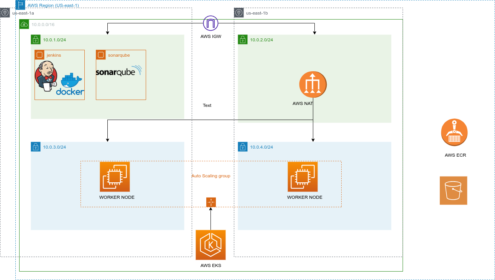

# Demo-DevOps-project - Terraform Infrastructure Deployment

This repository contains the Terraform code for deploying and managing the infrastructure of the Demo-DevOps-project using Infrastructure as Code (IAC) principles.

## Table of Contents

- [Prerequisites](#prerequisites)
- [Getting Started](#getting-started)
- [Infrastructure Overview](#infrastructure-overview)
- [Diagrams](#diagrams)
- [Directory Structure](#directory-structure)
- [Cleaning Up](#cleaning-up)
- [Contributing](#contributing)

## Prerequisites

Before you start using this Terraform code, make sure you have the following prerequisites set up:

- [Terraform ](https://developer.hashicorp.com/terraform/downloads)
- [AWS CLI](https://docs.aws.amazon.com/cli/latest/userguide/getting-started-install.html) configured with appropriate credentials

## Getting Started

1. Clone the Demo-DevOps-project repository:

   ```bash
   git clone https://github.com/Mohmed3del/Demo-DevOps-project.git
   ```
2. Navigate to the Terraform directory:

    ```bash
    cd Demo-DevOps-project/Terraform
    ```
3. Initialize Terraform:


    ```bash
    terraform init
    ```

    Modify the terraform.tfvars file to provide the required variables and configurations for your environment.

    Review and adjust the Terraform code in the .tf files according to your specific infrastructure requirements.

4. Plan the Terraform deployment:

    ```bash
    terraform plan
    ```

5. Deploy the infrastructure:

    ```bash
    terraform apply --auto-approve
    ```


## Infrastructure Overview

The Terraform code in this repository is designed to deploy a comprehensive infrastructure for the Demo-DevOps-project. The infrastructure includes various components that work together to support the project's functionality and operations. Below is an overview of the key components that will be deployed:

### Network Setup

The network setup involves creating Virtual Private Cloud (VPC) resources such as subnets, route tables, and security groups. The VPC provides isolated networking environments for the rest of the infrastructure components. Security groups are configured to control inbound and outbound traffic, ensuring a secure network environment.

### EC2 Instances

EC2 instances are launched within the previously defined subnets. These instances serve as compute resources to host applications, services, and databases. The Terraform code allows specifying instance types, AMIs, and other configuration options.

### Amazon ECR Repositories

Amazon Elastic Container Registry (ECR) repositories are created to store Docker container images. These repositories provide a secure and scalable way to manage container images that can be used for deploying applications in containers.

### Private Key Generation

A private key pair is generated to enable secure access to EC2 instances. The private key is generated locally and securely stored. It can be used to SSH into instances for troubleshooting or management purposes.

### Terraform Backend with Amazon S3

Terraform's state files are stored remotely in an Amazon S3 bucket. This helps maintain the state of your infrastructure across different environments and team members. Additionally, a DynamoDB table is used for locking to prevent concurrent modifications to the state.

### Amazon EKS Cluster

An Amazon Elastic Kubernetes Service (EKS) cluster is provisioned using the Terraform EKS module. EKS provides managed Kubernetes clusters for deploying, managing, and scaling containerized applications using Kubernetes.

This Terraform setup creates a robust and scalable infrastructure that supports the Demo-DevOps-project's requirements. Each component is carefully configured to ensure security, reliability, and ease of management.


## Diagrams




## Directory Structure
```bash
Terraform/
├── backend.tf
├── kay-pair.tf
├── main.tf
├── Modules
│   ├── EC2
│   │   ├── ami_data.tf
│   │   ├── main.tf
│   │   ├── sg.tf
│   │   └── variabels.tf
│   ├── ECR
│   │   ├── main.tf
│   │   └── variabels.tf
│   ├── EKS
│   │   ├── csi-driver-addon.tf
│   │   ├── csi-driver-iam.tf
│   │   ├── EKS.tf
│   │   ├── iam-oidc.tf
│   │   ├── IAMrole_eks.tf
│   │   ├── IAMrole_Node.tf
│   │   ├── nodes_worker.tf
│   │   ├── outputs.tf
│   │   ├── security_eks.tf
│   │   └── variable.tf
│   └── network
│       ├── aws_availability_zones.tf
│       ├── eip.tf
│       ├── igw.tf
│       ├── nat_gw.tf
│       ├── outputs.tf
│       ├── route_tabel.tf
│       ├── subents.tf
│       ├── variables.tf
│       └── vpc.tf
├── outputs.tf
├── prod.auto.tfvars
├── providers.tf
├── public_ip.tf
├── resourse.tf
└── variables.tf
```

## Cleaning Up

When you no longer need the resources created by Terraform, it's important to clean up and destroy those resources to avoid incurring unnecessary costs. Follow the steps below to properly clean up the infrastructure:

1. Open a terminal :

    ```bash
    terraform destroy --auto-aprove
    ```
    You'll be prompted to confirm the destruction of the resources. Type yes to proceed.

2. Terraform will start destroying the resources based on the configuration in your .tf files. The process may take some time depending on the complexity of your infrastructure.

3. Once the destruction is complete, Terraform will display a summary of the resources that were destroyed. Review the output to ensure that all resources were removed successfully.

    Note: The terraform destroy command will permanently delete all the resources managed by Terraform. This action cannot be undone, so exercise caution before confirming.

    It's important to clean up the resources to avoid unnecessary charges on your cloud account. If you plan to continue using the infrastructure later, consider using separate environments or configurations to isolate resources and test deployments without impacting your main environment.

    Remember that the Terraform state may still contain information about the destroyed resources. If you want to completely remove all traces of the infrastructure, you can manually delete the Terraform state files from the backend.


## Contributing

Contributions to the Demo-DevOps-project are welcome! Whether you've found a bug, have suggestions for improvement, or want to add new features, your input is valuable. Here's how you can contribute:

### Reporting Issues

If you come across any issues, bugs, or unexpected behavior in the Terraform code or the project's functionality, please open an issue in the GitHub repository. Provide as much detail as possible, including the steps to reproduce the issue and any relevant logs.

### Suggesting Improvements

Have an idea to make the project better? Feel free to open an issue and suggest your improvement. Whether it's about code organization, documentation, or overall project structure, your suggestions are appreciated.


